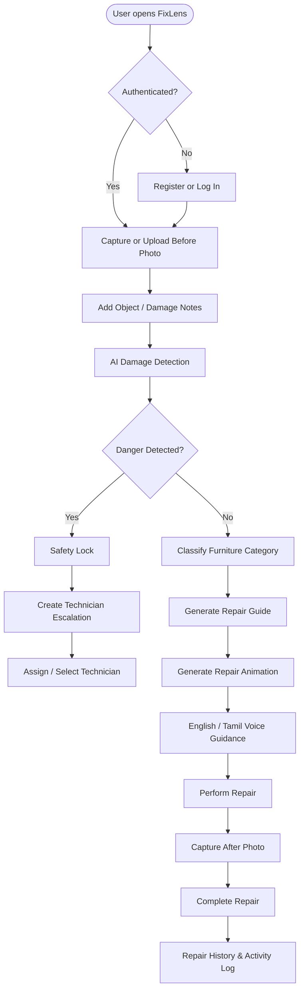
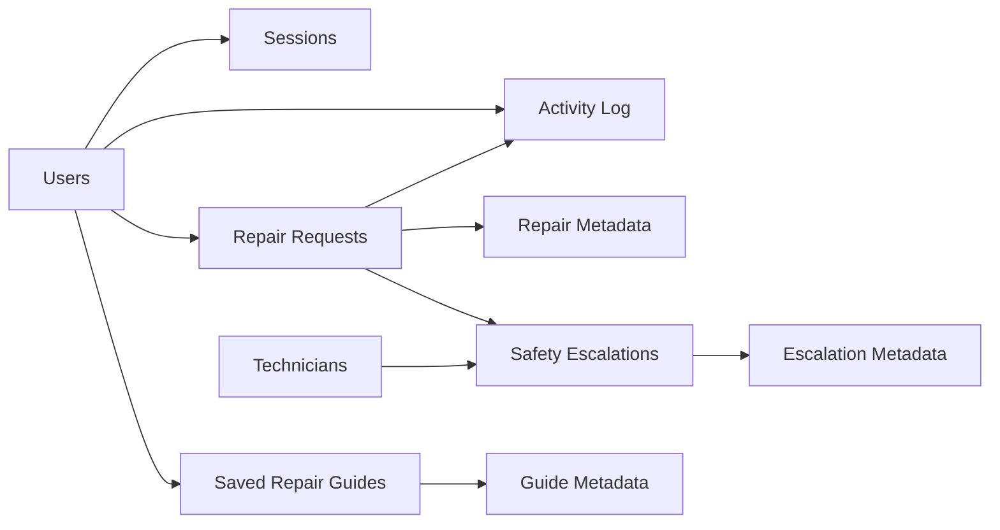
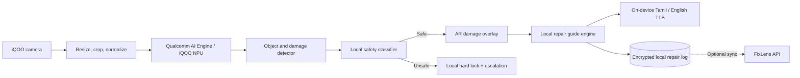
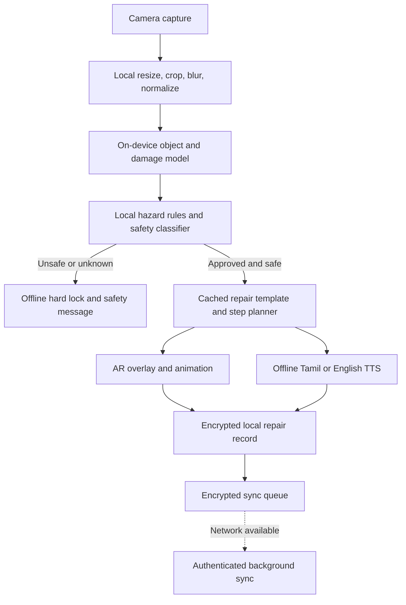
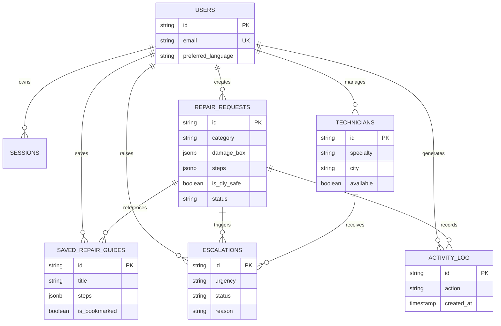

# FixLens

> **Scan. See the problem. Repair safely.**

FixLens is a visual AI repair assistant designed for iQOO phones. A user photographs a damaged everyday object, receives a highlighted diagnosis, follows a step-by-step repair guide with safety checks, and saves a before/after repair log.

This repository contains the current web MVP and its server-side API. The iQOO camera client, AR layer, ML Kit integration, and NPU-optimized model are part of the forward roadmap described below; they are not claimed to be fully implemented in this repository yet.

## Product Brief

### The one-line pitch

**FixLens turns an iQOO phone into a visual AI repair assistant: point the camera at a damaged object, see the damage highlighted, and receive a safe, localized repair guide instead of a generic video.**


### Why it matters

FixLens is deliberately narrow enough to be safe and polished: it starts with common furniture and household repairs, demonstrates the complete journey from raw damage to guided action, and refuses dangerous work. The project is not just an AI chatbot describing repairs. It connects camera input, visual detection, structured repair knowledge, animated video generation, English/Tamil guidance, a safety hard-lock, technician escalation, and a persistent repair record.

# FixLens — Product Capabilities & Technical Architecture

> **Scan. See the problem. Repair safely.**

FixLens transforms an **iQOO smartphone** into a visual AI repair assistant that helps users safely repair everyday household furniture using computer vision, guided animations, bilingual voice assistance, and an intelligent safety engine.

---

## Product Overview

FixLens is a **phone-first AI repair platform** designed for quick DIY furniture repairs. Instead of watching generic repair videos or calling a technician for minor issues, users simply scan the damaged object and receive a personalized, interactive repair experience.

### Core Value Proposition

- Scan damaged furniture using the phone camera.
- AI detects the damaged area on-device.
- Interactive repair guide with visual overlays and animations.
- Safety engine prevents dangerous DIY repairs.
- Repair history with before/after proof.

---

## Product Capabilities

| Product Area | Focus | FixLens Implementation | User Experience |
|---------------|-------|------------------------|-----------------|
| **End-to-End Product Flow** | Complete repair lifecycle | Scan → Detect → Guide → Repair → Proof workflow with safety checkpoints and history. | Users complete an entire repair journey from a single photo to a saved repair log. |
| **Real-World Impact** | Affordable DIY assistance | Camera becomes a repair-specific AI assistant instead of generic search or YouTube videos. | Saves technician visits for low-risk repairs while preventing unsafe repairs. |
| **Phone-First Experience** | Native smartphone interaction | Camera capture, object detection, AR damage highlighting, English/Tamil narration, generated repair animations. | Continuous mobile experience optimized for iQOO devices. |
| **Engineering Depth** | Reliable AI architecture | AI vision with deterministic fallback, typed domain models, safety engine, Drizzle ORM, API routes, and media pipeline. | Explicit repair states, persistence, recovery behavior, and scalable architecture. |
| **Phone-to-Laptop Continuity** | Multi-device workflow | Shared REST APIs, responsive dashboard, uploads, repair history, technician escalation. | Begin repairs on phone and continue reviewing history or escalations on desktop. |
| **Guided Product Walkthrough** | Demo-friendly storytelling | Named repair scenarios, safety interruption flow, before/after validation, repair evidence. | Clear live demonstration for hackathons and product presentations. |

---

## End-to-End User Journey

```text
User Opens FixLens
        │
        ▼
 Login / Register
        │
        ▼
 Capture or Upload Before Photo
        │
        ▼
 Add Damage Notes (Optional)
        │
        ▼
 AI Damage Detection
        │
        ▼
 Safety Decision Engine
        │
   ┌────┴─────┐
   │          │
Unsafe      Safe
   │          │
   ▼          ▼
Technician   Repair Classification
Escalation       │
                 ▼
       Generate Repair Guide
                 │
                 ▼
    Repair Video + AR Overlay
                 │
                 ▼
   English / Tamil Voice Guide
                 │
                 ▼
      Perform Repair Steps
                 │
                 ▼
      Capture After Photo
                 │
                 ▼
     Save Repair Proof & History
```

---

## Safety Engine

Safety is the core differentiator of FixLens. Every repair request passes through a deterministic safety engine before repair instructions are shown.

### Repair Decision States

| Safety State | System Behavior |
|--------------|-----------------|
| **Low Risk** | Interactive repair guide is enabled immediately. |
| **Medium Risk** | Repair allowed with additional warnings, required tools, and safety notes. |
| **High Risk** | DIY repair is blocked and technician escalation is recommended. |
| **Critical** | Repair session is locked and emergency guidance is shown instead of repair steps. |

### Repair Template Includes

- Difficulty level
- Severity score
- Safety level
- Safety warnings
- Required tools
- Required materials
- Estimated repair time
- Interactive repair steps
- Voice narration assets
- Cost estimation

---

### Automatically Escalated Categories

- Electrical appliances
- Structural wall damage
- Gas pipelines
- Water leakage
- Broken tempered glass
- Heavy furniture collapse

These repair requests are automatically escalated to a technician.

---

## AI Pipeline

### AI Detection Workflow

```text
Camera Image
      │
      ▼
Image Preprocessing
      │
      ▼
AI Vision Detection
      │
      ▼
Damage Classification
      │
      ▼
Confidence Scoring
      │
      ▼
Safety Decision Engine
      │
      ▼
Personalized Repair Guide
```

### AI Responsibilities

| AI Module | Purpose |
|-----------|---------|
| Object Detection | Detect furniture category. |
| Damage Localization | Highlight damaged area with bounding boxes. |
| Damage Classification | Identify loose screws, cracks, hinges, wobble, and similar issues. |
| Confidence Engine | Estimate prediction confidence. |
| Safety Filter | Decide whether DIY repair is safe. |
| Guide Generator | Generate repair steps, tools, and cost estimates. |

---

## Interactive Repair Experience

Instead of showing generic repair videos, FixLens generates an interactive repair experience tailored to the detected damage.

### Experience Includes

- AI-highlighted damaged area.
- Animated repair overlays.
- Step-by-step repair animation.
- Tool placement guidance.
- English and Tamil voice narration.
- Progress tracking.
- Completion checklist.

---

## Phone-to-Laptop Continuity

Users can seamlessly switch between devices without losing repair progress.

| Phone Experience | Desktop Dashboard |
|------------------|-------------------|
| Scan damaged object | Review repair history |
| Follow repair steps | Manage saved guides |
| Capture before/after proof | Technician dashboard |
| Voice-guided repair | Escalation management |
| Offline local mode | Analytics and activity logs |

The same REST APIs synchronize both interfaces.

---

## Technical Architecture

### Layered System Design

| Layer | Responsibility | Current Implementation |
|-------|----------------|------------------------|
| Presentation | Landing page, authentication, dashboard, repair wizard, guides, history, settings, technicians. | Next.js App Router with React Client Components |
| Transport | API routing, request parsing, authentication checks, response formatting. | `src/app/api/**/route.ts`, `src/lib/api-utils.ts` |
| Validation | Request and domain validation. | Zod schemas in `src/lib/validation.ts` |
| Domain | Repair templates, categories, tools, costs, narration, safety rules. | `src/lib/repairKnowledge.ts` |
| AI Orchestration | Cloud vision with deterministic local fallback. | `src/lib/aiVision.ts` |
| Persistence | Users, repairs, technicians, guides, sessions, activity logs. | Drizzle ORM with PostgreSQL / PGlite |
| Media | Image uploads, repair videos, English/Tamil audio assets. | Upload API, Canvas Video Generator, `public/audio/` |
| Security | Cookie sessions, password hashing, protected routes, middleware. | `src/lib/auth.ts`, `src/middleware.ts`, `.env` |

---

## Data Persistence Model

### Primary Entities

| Entity | Purpose |
|--------|---------|
| Users | Authentication and user profiles. |
| Sessions | Secure login sessions. |
| Repairs | Repair requests and AI results. |
| Repair Guides | Generated repair instructions. |
| Repair History | Before/after proof and timestamps. |
| Technicians | Technician assignment records. |
| Escalations | Unsafe repair cases requiring professional help. |
| Activity Logs | Complete repair timeline and audit trail. |

---

## API Surface

| Endpoint | Purpose |
|----------|---------|
| `POST /api/ai/detect` | AI damage detection from uploaded images. |
| `POST /api/upload` | Upload before/after repair images. |
| `GET /api/repairs` | Retrieve repair history. |
| `POST /api/repairs` | Create a repair request. |
| `POST /api/escalate` | Escalate unsafe repair cases. |
| `GET /api/guides` | Fetch generated repair guides. |
| `POST /api/auth/login` | User authentication. |
| `POST /api/auth/register` | User registration. |

---

## Current Implementation Status

| Capability | Repository Status |
|------------|-------------------|
| Responsive Web Product | Implemented |
| Authentication & Sessions | Implemented |
| Camera Upload Flow | Implemented |
| AI Detection API | Implemented |
| Safety Decision Engine | Implemented |
| Guided Repair Templates | Implemented |
| Repair History | Implemented |
| English & Tamil Voice Guidance | Implemented |
| Repair Video Generation Pipeline | Implemented |
| Technician Escalation Workflow | Implemented |
| Phone-to-Desktop Continuity | Implemented |
| Activity Log Dashboard | Implemented |

---

## Why FixLens

FixLens is designed as a practical AI-powered repair assistant for smartphones.

- Phone-first repair experience built for iQOO devices.
- Personalized repair guidance instead of generic tutorials.
- Deterministic safety engine that blocks unsafe DIY repairs.
- Bilingual English and Tamil voice guidance.
- Repair proof and history for every completed repair.
- Lightweight MVP architecture that scales to additional repair categories.

---

## End-to-End Workflow

The FixLens repair journey follows a safety-first workflow from image capture to repair completion and history logging.



---

## Data Model Relationships

The persistence layer connects users, repairs, guides, technicians, and safety escalations through a structured relational model.



### Repair Metadata

Each repair request stores:

- Furniture category
- Damage summary
- Damage bounding box coordinates
- AI confidence score
- Safety level
- Repair status
- Generated repair steps

### Guide Metadata

Each repair guide contains:

- Required tools
- Required materials
- Estimated repair time
- Safety notes
- Step-by-step instructions
- Saved bookmarks

### Escalation Metadata

When DIY repair is unsafe, FixLens stores:

- Escalation reason
- Urgency level
- Technician assignment
- Current status
- Timestamp and activity history

---

## Safety Rules

Every permitted repair template includes a complete safety specification before guidance is generated.

| Field | Description |
|-------|-------------|
| Difficulty | Beginner, Intermediate, Advanced |
| Severity | Damage severity score |
| Safety Level | Low, Medium, High, Critical |
| Safety Notes | Precautions before starting repair |
| Required Tools | Tools needed for the repair |
| Materials | Parts or materials required |
| Estimated Time | Expected completion time |
| Repair Steps | Guided repair workflow |

If a repair exceeds the safe DIY threshold, FixLens automatically creates a technician escalation with urgency, reason, status, and optional technician assignment.

---

## Vision Model Contract

The AI Vision adapter normalizes every detection into a consistent contract. This abstraction allows different vision models to be swapped without changing the repair workflow.

```ts
interface VisionDetection {
  category: string;
  objectLabel: string;
  damageSummary: string;

  damageBox: {
    x: number;
    y: number;
    w: number;
    h: number;
  };

  confidenceScore: number;

  isDangerous: boolean;
  dangerCategory: string | null;

  isDiySafe: boolean;
}
```

### Why This Contract Matters

- Standardizes AI detection output across providers.
- Supports Gemini, on-device ML models, or future NPU inference.
- Keeps repair generation independent of the underlying vision model.
- Ensures consistent safety evaluation and repair guide generation.
- Makes the AI layer modular and production-ready.

## iQOO NPU and On-Device AI Roadmap

The product target is a native iQOO phone experience using the camera, local inference, AR rendering, local storage, and device TTS. The current web app is the API and domain prototype for that client.

### Target device architecture



### Recommended implementation phases

| Phase | Goal | Candidate technology | Exit criteria |
| --- | --- | --- | --- |
| 1. Native shell | Move scan flow to the phone | Flutter or Kotlin, CameraX, local file storage | Capture, crop, preview, retry, and permission states work offline |
| 2. Baseline edge model | Replace heuristic fallback with a compact detector | TensorFlow Lite or ONNX Runtime Mobile, ML Kit for barcode/text utilities | Category and box detection runs without a network request |
| 3. NPU delegate | Accelerate inference on iQOO hardware | Qualcomm QNN / Android NNAPI delegate, device-specific profiling | Stable FPS, bounded battery/thermal use, confidence parity with baseline |
| 4. AR guidance | Anchor repair overlays to the object | ARCore, camera pose tracking, Flutter AR plugin or Kotlin rendering | Step arrows and highlights remain stable while the camera moves |
| 5. Offline safety gate | Make refusal dependable without connectivity | Quantized safety classifier plus deterministic rule layer | Dangerous examples are blocked locally and fail closed |
| 6. Sync and learning | Synchronize logs and improve models | Authenticated API sync, consented telemetry, reviewed training set | Offline-first usage with conflict-safe repair history |

### NPU model design

- Start with a small object detector and damage-localization head rather than a general multimodal model.
- Quantize to INT8 after establishing a floating-point accuracy baseline.
- Export through a stable intermediate format such as TFLite or ONNX, then benchmark the Qualcomm delegate on target iQOO devices.
- Keep the safety classifier separate from the repair recommendation model so a recommendation model cannot override a safety refusal.
- Use confidence thresholds and an `unknown` result. Unknown must route to caution or technician escalation, never to an invented repair.
- Cache approved repair templates on-device so the guide still works with no network.
- Treat images as private by default. Cloud fallback should be opt-in, explicit, and visibly indicated.

### Fully Offline Processing Plan

The long-term iQOO experience is designed to complete the core scan-to-guide loop without sending an image or repair notes to a server. Network access becomes an optional enhancement for synchronization, model updates, and professional dispatch rather than a runtime dependency.



Offline mode will include:

- **On-device image processing:** Resize and inspect frames locally before inference. Original photos remain on the phone unless the user explicitly enables cloud assistance.
- **NPU-accelerated detection:** Run a quantized object and damage detector through the Qualcomm AI Engine, Android NNAPI, or a validated TFLite/ONNX delegate.
- **Local safety first:** Run hazard keyword rules and a small safety classifier on the device. An unsafe or uncertain result fails closed and never falls through to a DIY instruction.
- **Cached repair knowledge:** Ship signed, versioned templates for approved categories, including tools, materials, steps, timing, safety notes, and Tamil/English text.
- **Offline voice guidance:** Use downloadable on-device Android TTS voices or bundled audio for both supported languages; do not require a cloud voice request during a repair.
- **Encrypted local history:** Store before/after references, detection metadata, completion status, and user notes in encrypted SQLite/Room or an encrypted Flutter database.
- **Deferred synchronization:** Queue only the records the user has consented to sync. Upload occurs later with retries, conflict handling, model-version metadata, and signed requests.
- **Graceful degradation:** If NPU inference is unavailable, use the CPU/GPU delegate with a visible lower-performance state. If confidence is insufficient, show `needs review` or escalate rather than inventing a diagnosis.

Offline acceptance tests will cover airplane-mode startup, image privacy, safe-category completion, dangerous-category blocking, Tamil/English playback, interrupted sync, duplicate sync prevention, battery/thermal limits, and model rollback.

## Tech Stack

### Current repository

| Area | Technology | Purpose |
| --- | --- | --- |
| Web framework | Next.js 16 App Router | Full-stack React application and route handlers |
| UI | React 19, Tailwind CSS 4, Lucide React | Dashboard, forms, repair visualization, icons |
| Language | TypeScript 5.9 | Application and domain types |
| Data access | Drizzle ORM | Typed database queries and schema |
| Local database | PGlite | File-backed PostgreSQL-compatible development fallback |
| Production database | PostgreSQL via `pg` | Persistent deployment database |
| Validation | Zod 4 | API and form validation |
| Auth | Cookie sessions, `bcryptjs`, Web Crypto UUIDs | Login, protected routes, password hashing |
| Vision | Gemini 1.5 Flash optional; local heuristic fallback | Image classification and damage localization |
| Video | Canvas-based generator and WebM/MP4-compatible media routes | Repair walkthrough generation |
| Audio | English and Tamil assets plus TTS API route | Voice guidance and localized repair instructions |
| Tooling | ESLint, TypeScript, Drizzle Kit, PostCSS | Quality checks and database development |

### Planned mobile stack

- **Client:** Flutter for shared UI, or Kotlin/Jetpack Compose for deepest Android and Qualcomm integration.
- **Camera:** CameraX and an iQOO-tested capture pipeline.
- **On-device vision:** ML Kit utilities plus a custom TFLite/ONNX detector.
- **NPU acceleration:** Android NNAPI or Qualcomm QNN delegate, validated on target iQOO hardware.
- **AR:** ARCore with native rendering where Flutter plugin latency is insufficient.
- **Storage:** Encrypted SQLite/Room or an encrypted Flutter database for offline repair logs.
- **Speech:** Android on-device TTS with Tamil and English voice availability checks.
- **Sync:** The existing REST API, extended with device sync, model version, and consent metadata.

## LLM and AI Services

### Current

- **Gemini 1.5 Flash:** Optional multimodal cloud fallback in `src/lib/aiVision.ts`. It receives the image and user notes and must return constrained JSON. The API key is server-side only.
- **FixLens edge vision fallback:** Deterministic local image-buffer variance plus keyword rules. This keeps the demo usable without a Gemini key but should not be confused with a trained edge model.
- **Repair knowledge engine:** Curated deterministic templates provide the final allowed category, safety metadata, tools, materials, steps, cost range, and narration.
- **TTS route:** `/api/ai/tts` serves the project’s English/Tamil narration path. Production mobile TTS should prefer on-device voices.

### Planned AI responsibilities

| Responsibility | Preferred execution | Why |
| --- | --- | --- |
| Object and damage detection | iQOO NPU | Low latency, privacy, offline use |
| Hazard screening | NPU model plus deterministic rules | Fail-closed safety behavior |
| Repair step selection | Local templates first; optional server LLM assistance | Predictable instructions and low hallucination risk |
| Natural-language explanation | Optional server LLM with structured output | Better descriptions without controlling safety |
| Voice guidance | On-device TTS | Offline playback and lower data exposure |
| Model updates | Signed, versioned downloads | Improve detection without shipping a full app update |

An LLM must never be the sole authority for dangerous-repair decisions. Safety rules, category allowlists, confidence thresholds, and technician escalation remain deterministic controls around the model.

## API Reference

All application data routes use the authenticated session cookie unless noted otherwise. Request and response validation belongs in the route and shared validation utilities.

| Method | Endpoint | Purpose |
| --- | --- | --- |
| GET | `/api/health` | Service health check |
| POST | `/api/auth/register` | Create an account and session |
| POST | `/api/auth/login` | Authenticate and create a session |
| POST | `/api/auth/logout` | Clear the current session |
| GET | `/api/auth/me` | Read the current user |
| PATCH | `/api/account` | Update account details |
| PATCH | `/api/account/password` | Change the account password |
| POST | `/api/upload` | Store an uploaded repair image |
| POST | `/api/ai/detect` | Detect object, damage box, category, confidence, and safety |
| GET | `/api/ai/tts` | Retrieve or generate localized narration audio |
| GET, POST | `/api/repairs` | List or create repair requests |
| GET, PATCH, DELETE | `/api/repairs/:id` | Read, update, or remove a repair request |
| POST | `/api/repairs/:id/video` | Generate a repair walkthrough video |
| GET, POST | `/api/guides` | List or create saved repair guides |
| GET, PATCH, DELETE | `/api/guides/:id` | Read, update, or remove a guide |
| GET, POST | `/api/technicians` | List or create technicians |
| PATCH, DELETE | `/api/technicians/:id` | Update or remove a technician |
| GET, POST | `/api/escalations` | List or create safety escalations |
| PATCH, DELETE | `/api/escalations/:id` | Update or cancel an escalation |

## Data Model

The Drizzle schema models the complete repair lifecycle:



Repair status values are `analyzing`, `ready`, `in_progress`, `completed`, and `escalated`. Escalation status values are `pending`, `accepted`, `in_progress`, `resolved`, and `cancelled`.

## Project Structure

```text
src/
	app/
		api/                  REST-style Next.js route handlers
		dashboard/            Authenticated product screens
		login/ register/      Authentication screens
	components/
		auth/ dashboard/      Shared shell, sidebar, and topbar
		repairs/              Scan wizard, upload, damage, guide, video, escalation UI
		guides/ settings/     Saved guides and account management UI
		ui/                   Badges, dialogs, misc controls, and toast
	db/
		schema.ts             Drizzle tables, enums, and inferred types
		index.ts              PGlite/Postgres selection and table initialization
		seed.ts               Development seed data
	lib/
		aiVision.ts           Gemini adapter and local edge fallback
		repairKnowledge.ts    Allowed templates and safety hard-lock rules
		auth.ts               Session cookie and user lookup helpers
		validation.ts         Zod request validation
		canvas-video-generator.ts
													Generated repair video implementation
		data/                 Data access helpers for domain collections
public/
	audio/en, audio/ta/     Localized audio assets
	videos/ uploads/        Media directories
scripts/                  Utility scripts such as audio generation
```

## Getting Started

### Requirements

- Node.js 20 or newer
- npm
- No database is required for the default local PGlite mode
- PostgreSQL is required when using a remote database

### Install and run

```bash
npm install
Copy-Item .env.example .env
npm run dev
```

On Windows PowerShell, use `Copy-Item`. On macOS/Linux:

```bash
cp .env.example .env
npm install
npm run dev
```

Open `http://localhost:3000`.

### Environment variables

| Variable | Required | Description |
| --- | --- | --- |
| `DATABASE_URL` | No for local PGlite | PostgreSQL connection string. Non-local URLs select PostgreSQL automatically. |
| `USE_POSTGRES` | No | Set to `true` to force PostgreSQL mode. |
| `PGLITE_DIR` | No | Override the local PGlite directory. Defaults to `.fixlens-db`. |
| `SESSION_SECRET` | Recommended | Secret reserved for production session hardening and deployment configuration. |
| `GEMINI_API_KEY` | No | Enables the optional Gemini vision path. Never expose it to the browser. |
| `PORT` | No | Local server port; defaults to the Next.js convention. |

The real `.env` file, local database, uploads, and build artifacts are ignored by Git. Use `.env.example` as the safe configuration template.

### Development commands

```bash
npm run dev        # Start the development server
npm run build      # Create a production build
npm run start      # Serve the production build
npm run lint       # Run ESLint
npm run typecheck  # Run TypeScript without emitting files
```

## Security and Privacy

- Keep API keys and database credentials server-side.
- Do not commit `.env`, uploaded photos, local PGlite state, or generated private media.
- Use secure, HTTP-only cookies in production and deploy behind HTTPS.
- Hash passwords with a strong work factor and rotate session secrets through the deployment secret store.
- Validate MIME type, file size, and image dimensions before accepting uploads.
- Apply authorization checks to every user-owned repair, guide, escalation, and activity record.
- Treat cloud vision as opt-in for the mobile client and disclose when an image leaves the device.
- Encrypt sensitive local repair history on the phone.
- Sign model updates and reject models with unknown or incompatible versions.
- Log safety decisions and model versions without storing unnecessary raw images.

## Future Implementation Roadmap

### Near term

1. Add a production migration workflow instead of relying only on startup DDL.
2. Add automated route tests for authentication, safety blocking, uploads, and ownership checks.
3. Add a real trained detector behind the existing vision result contract.
4. Move generated videos and uploaded media to object storage with signed URLs.
5. Add rate limiting, upload scanning, structured logging, and error monitoring.

### iQOO device release

1. Build the native camera and scan experience in Flutter or Kotlin.
2. Run the first detector locally through TFLite or ONNX Runtime Mobile.
3. Benchmark CPU, GPU, and Qualcomm NPU delegates on representative iQOO models.
4. Add ARCore anchored overlays for the damage box and each repair step.
5. Make safety screening and approved repair templates available offline.
6. Add encrypted local history and consent-based background sync.
7. Validate Tamil and English on-device speech availability and accessibility.

### Success metrics

- Detection precision and damage-box overlap by approved category
- Dangerous-repair false-negative rate, with a target of zero in the acceptance set
- Time from camera capture to first useful overlay
- Offline completion rate
- Battery and thermal impact during a full scan-to-guide session
- Repair completion rate and after-photo confirmation rate
- Tamil and English narration comprehension in usability testing

## Limitations and Non-Goals

- The current local fallback is heuristic, not a trained NPU model.
- The current web UI is not a native iQOO camera or AR client.
- AR anchoring and true on-device ML Kit inference are roadmap items.
- FixLens does not replace qualified professionals for dangerous, regulated, structural, medical, gas, electrical, or vehicle-brake work.
- A high confidence score is not permission to bypass the safety gate.


> FixLens is like having a technician in your pocket - safer, cheaper, and instant. It does not just tell you what is wrong; it shows you exactly how to fix it, step by step, on your phone screen.
