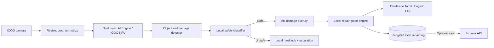
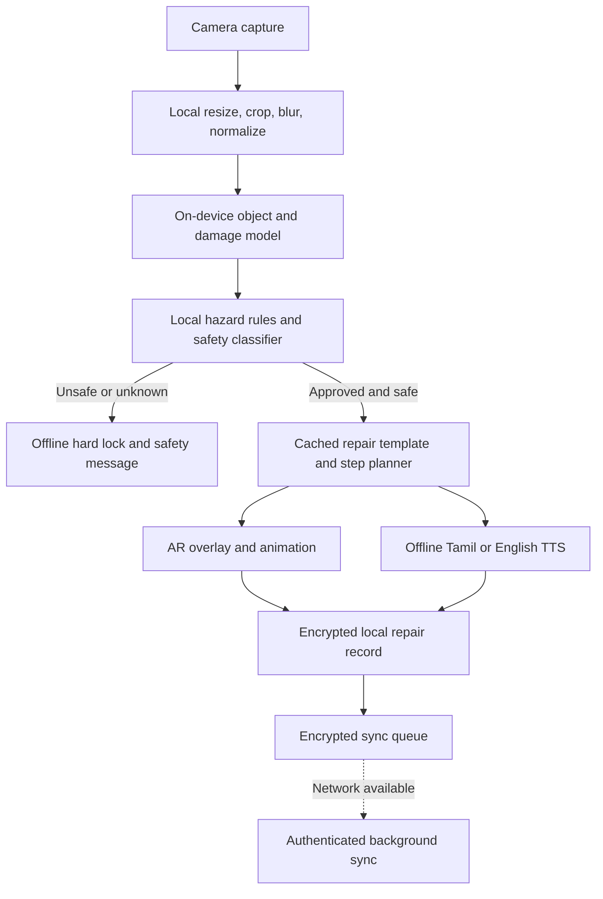
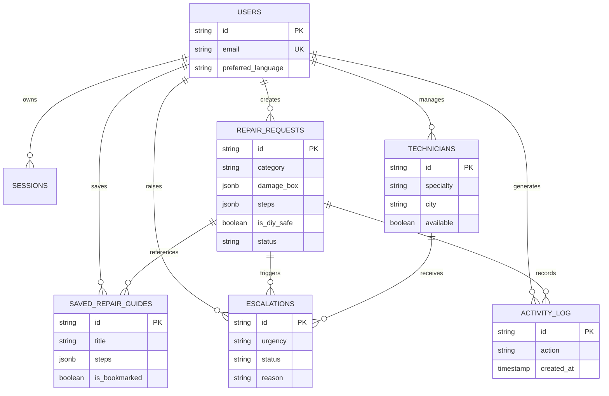

# FixLens

> **Scan. See the problem. Repair safely.**

FixLens is a visual AI repair assistant designed for iQOO phones. A user photographs a damaged everyday object, receives a highlighted diagnosis, follows a step-by-step repair guide with safety checks, and saves a before/after repair log.

This repository contains the current web MVP and its server-side API. The iQOO camera client, AR layer, ML Kit integration, and NPU-optimized model are part of the forward roadmap described below; they are not claimed to be fully implemented in this repository yet.

## Product Brief

### The one-line pitch

**FixLens turns an iQOO phone into a visual AI repair assistant: point the camera at a damaged object, see the damage highlighted, and receive a safe, localized repair guide instead of a generic video.**

### Why it matters

FixLens is deliberately narrow enough to be safe and polished: it starts with common furniture and household repairs, demonstrates the complete journey from raw damage to guided action, and refuses dangerous work. The project is not just an AI chatbot describing repairs. It connects camera input, visual detection, structured repair knowledge, animated video generation, English/Tamil guidance, a safety hard-lock, technician escalation, and a persistent repair record.

### Product capabilities and evidence

| Product area | Focus | FixLens evidence | Product experience |
| --- | ---: | --- | --- |
| End-to-end product | Scan -> detect -> guide -> proof flow; focused furniture MVP; safety states; history and saved guides | A user captures an object, inspects the result, follows steps, and saves the outcome |
| Real-world impact | Phone camera becomes a repair-specific assistant instead of another generic search result | A household gets specific guidance while unsafe work is refused |
| Phone experience | Camera/photo capture, local edge contract, English/Tamil voice assets, damage box, generated repair video | The scan, diagnosis, localized narration, and repair animation form one continuous phone flow |
| Engineering depth | Layered AI fallback, typed domain model, deterministic safety gate, Drizzle schema, PGlite/Postgres, sessions, media pipeline, API surface | The product has explicit states, persistence, failure behavior, and a working full-stack path |
| Phone-to-laptop continuity | Responsive dashboard, shared REST handlers, phone upload, local mode, repair history | The phone starts the repair request while the laptop dashboard reviews, manages, escalates, and records it through the same API |
| Product walkthrough | Named demo object, visible safety interruption, before/after proof, and a concise narrative | The workflow can be understood quickly without relying on abstract claims |

### Claims and implementation status

| Capability | Status in this repository |
| --- | --- |
| Responsive web product and dashboard | Implemented |
| Camera-compatible photo upload and damage workflow | Implemented |
| Structured repair templates and animated repair video generation | Implemented |
| English and Tamil narration assets/API path | Implemented |
| Deterministic dangerous-repair hard lock and escalation | Implemented |
| Optional Gemini multimodal vision adapter | Implemented when `GEMINI_API_KEY` is configured |
| Local heuristic edge fallback | Implemented for development/demo fallback |
| Native iQOO app, ML Kit, AR overlays, and Qualcomm NPU delegate | Roadmap; described as planned, not complete |

The product boundary is intentional: the web MVP proves the product and safety workflow today, while the iQOO NPU plan shows how the same stable detection contract becomes an offline, private device experience.

## Product Overview
flowchart TD
    Users[Users] --> Sessions[Sessions]
    Users --> Repairs[Repair requests]
    Users --> Guides[Saved repair guides]
    Users --> Technicians[Technicians]
    Users --> Escalations[Safety escalations]
    Users --> Activity[Activity log]
    Repairs --> Guides
    Repairs --> Escalations
    Technicians --> Escalations
    Repairs --> Activity
    Repairs --> RepairData[Category, damage box, steps, safety, status]
    Guides --> GuideData[Tools, materials, notes, bookmarks]
    Escalations --> EscalationData[Reason, urgency, technician, status]
	API --> Storage[Upload and generated media storage]
	API --> DB[Drizzle data layer]
	DB --> PGlite[PGlite local database]
	DB --> Postgres[PostgreSQL deployment]
	Vision --> Edge[Local edge fallback: pixel variance and keyword rules]
	Vision --> Gemini[Optional Gemini 1.5 Flash vision API]
	API --> TTS[Optional English/Tamil TTS route]
	API --> Video[Canvas-based repair video generator]
	API --> Escalation[Technician escalation workflow]
```

### Architectural layers

| Layer | Responsibility | Current implementation |
| --- | --- | --- |
| Presentation | Landing page, auth, dashboard, repair wizard, guides, history, settings, technicians, escalations | Next.js App Router and React client components |
| Transport | Request parsing, route handlers, response shaping, auth checks | `src/app/api/**/route.ts` and `src/lib/api-utils.ts` |
| Validation | Request and domain input validation | Zod schemas in `src/lib/validation.ts` |
| Domain | Allowed categories, dangerous categories, templates, steps, costs, tools, safety notes, narration | `src/lib/repairKnowledge.ts` |
| AI orchestration | Optional cloud vision followed by deterministic local fallback | `src/lib/aiVision.ts` |
| Persistence | Users, sessions, repairs, guides, technicians, escalations, activity log | Drizzle ORM with PGlite or PostgreSQL |
| Media | Uploads, generated repair video, English/Tamil audio | `src/app/api/upload`, `src/lib/canvas-video-generator.ts`, `public/audio/` |
| Security | Cookie session, password hashing, protected routes, secret isolation | `src/lib/auth.ts`, `src/middleware.ts`, `.env` |

## End-to-End Workflow

```mermaid
flowchart TD
		Start([User opens FixLens]) --> Login{Authenticated?}
		Login -- No --> Register[Register or log in]
		Login -- Yes --> Capture[Capture or upload before photo]
		Register --> Capture
		flowchart TD
		    Users[Users] --> Sessions[Sessions]
		    Users --> Repairs[Repair requests]
		    Users --> Guides[Saved repair guides]
		    Users --> Technicians[Technicians]
		    Users --> Escalations[Safety escalations]
		    Users --> Activity[Activity log]
		    Repairs --> Guides
		    Repairs --> Escalations
		    Technicians --> Escalations
		    Repairs --> Activity
		    Repairs --> RepairData[Category, damage box, steps, safety, status]
		    Guides --> GuideData[Tools, materials, notes, bookmarks]
		    Escalations --> EscalationData[Reason, urgency, technician, status]
- Every permitted template carries difficulty, severity, safety level, safety notes, required tools, materials, estimated time, and repair steps.
- The system can escalate to a technician with urgency, reason, status, and optional technician assignment.

### Model contract

The vision adapter normalizes detection into:

```ts
{
	category: string;
	objectLabel: string;
	damageSummary: string;
	damageBox: { x: number; y: number; w: number; h: number };
	confidenceScore: number;
	isDangerous: boolean;
	dangerCategory: string | null;
	isDiySafe: boolean;
}
```

Keeping this contract stable allows Gemini, an on-device model, or a future NPU delegate to be swapped without rewriting the repair workflow.

## iQOO NPU and On-Device AI Roadmap

The product target is a native iQOO phone experience using the camera, local inference, AR rendering, local storage, and device TTS. The current web app is the API and domain prototype for that client.

### Target device architecture



### Recommended implementation phases

| Phase | Goal | Candidate technology | Exit criteria |
| --- | --- | --- | --- |
| 1. Native shell | Move scan flow to the phone | Flutter or Kotlin, CameraX, local file storage | Capture, crop, preview, retry, and permission states work offline |
| 2. Baseline edge model | Replace heuristic fallback with a compact detector | TensorFlow Lite or ONNX Runtime Mobile, ML Kit for barcode/text utilities | Category and box detection runs without a network request |
| 3. NPU delegate | Accelerate inference on iQOO hardware | Qualcomm QNN / Android NNAPI delegate, device-specific profiling | Stable FPS, bounded battery/thermal use, confidence parity with baseline |
| 4. AR guidance | Anchor repair overlays to the object | ARCore, camera pose tracking, Flutter AR plugin or Kotlin rendering | Step arrows and highlights remain stable while the camera moves |
| 5. Offline safety gate | Make refusal dependable without connectivity | Quantized safety classifier plus deterministic rule layer | Dangerous examples are blocked locally and fail closed |
| 6. Sync and learning | Synchronize logs and improve models | Authenticated API sync, consented telemetry, reviewed training set | Offline-first usage with conflict-safe repair history |

### NPU model design

- Start with a small object detector and damage-localization head rather than a general multimodal model.
- Quantize to INT8 after establishing a floating-point accuracy baseline.
- Export through a stable intermediate format such as TFLite or ONNX, then benchmark the Qualcomm delegate on target iQOO devices.
- Keep the safety classifier separate from the repair recommendation model so a recommendation model cannot override a safety refusal.
- Use confidence thresholds and an `unknown` result. Unknown must route to caution or technician escalation, never to an invented repair.
- Cache approved repair templates on-device so the guide still works with no network.
- Treat images as private by default. Cloud fallback should be opt-in, explicit, and visibly indicated.

### Fully Offline Processing Plan

The long-term iQOO experience is designed to complete the core scan-to-guide loop without sending an image or repair notes to a server. Network access becomes an optional enhancement for synchronization, model updates, and professional dispatch rather than a runtime dependency.



Offline mode will include:

- **On-device image processing:** Resize and inspect frames locally before inference. Original photos remain on the phone unless the user explicitly enables cloud assistance.
- **NPU-accelerated detection:** Run a quantized object and damage detector through the Qualcomm AI Engine, Android NNAPI, or a validated TFLite/ONNX delegate.
- **Local safety first:** Run hazard keyword rules and a small safety classifier on the device. An unsafe or uncertain result fails closed and never falls through to a DIY instruction.
- **Cached repair knowledge:** Ship signed, versioned templates for approved categories, including tools, materials, steps, timing, safety notes, and Tamil/English text.
- **Offline voice guidance:** Use downloadable on-device Android TTS voices or bundled audio for both supported languages; do not require a cloud voice request during a repair.
- **Encrypted local history:** Store before/after references, detection metadata, completion status, and user notes in encrypted SQLite/Room or an encrypted Flutter database.
- **Deferred synchronization:** Queue only the records the user has consented to sync. Upload occurs later with retries, conflict handling, model-version metadata, and signed requests.
- **Graceful degradation:** If NPU inference is unavailable, use the CPU/GPU delegate with a visible lower-performance state. If confidence is insufficient, show `needs review` or escalate rather than inventing a diagnosis.

Offline acceptance tests will cover airplane-mode startup, image privacy, safe-category completion, dangerous-category blocking, Tamil/English playback, interrupted sync, duplicate sync prevention, battery/thermal limits, and model rollback.

## Tech Stack

### Current repository

| Area | Technology | Purpose |
| --- | --- | --- |
| Web framework | Next.js 16 App Router | Full-stack React application and route handlers |
| UI | React 19, Tailwind CSS 4, Lucide React | Dashboard, forms, repair visualization, icons |
| Language | TypeScript 5.9 | Application and domain types |
| Data access | Drizzle ORM | Typed database queries and schema |
| Local database | PGlite | File-backed PostgreSQL-compatible development fallback |
| Production database | PostgreSQL via `pg` | Persistent deployment database |
| Validation | Zod 4 | API and form validation |
| Auth | Cookie sessions, `bcryptjs`, Web Crypto UUIDs | Login, protected routes, password hashing |
| Vision | Gemini 1.5 Flash optional; local heuristic fallback | Image classification and damage localization |
| Video | Canvas-based generator and WebM/MP4-compatible media routes | Repair walkthrough generation |
| Audio | English and Tamil assets plus TTS API route | Voice guidance and localized repair instructions |
| Tooling | ESLint, TypeScript, Drizzle Kit, PostCSS | Quality checks and database development |

### Planned mobile stack

- **Client:** Flutter for shared UI, or Kotlin/Jetpack Compose for deepest Android and Qualcomm integration.
- **Camera:** CameraX and an iQOO-tested capture pipeline.
- **On-device vision:** ML Kit utilities plus a custom TFLite/ONNX detector.
- **NPU acceleration:** Android NNAPI or Qualcomm QNN delegate, validated on target iQOO hardware.
- **AR:** ARCore with native rendering where Flutter plugin latency is insufficient.
- **Storage:** Encrypted SQLite/Room or an encrypted Flutter database for offline repair logs.
- **Speech:** Android on-device TTS with Tamil and English voice availability checks.
- **Sync:** The existing REST API, extended with device sync, model version, and consent metadata.

## LLM and AI Services

### Current

- **Gemini 1.5 Flash:** Optional multimodal cloud fallback in `src/lib/aiVision.ts`. It receives the image and user notes and must return constrained JSON. The API key is server-side only.
- **FixLens edge vision fallback:** Deterministic local image-buffer variance plus keyword rules. This keeps the demo usable without a Gemini key but should not be confused with a trained edge model.
- **Repair knowledge engine:** Curated deterministic templates provide the final allowed category, safety metadata, tools, materials, steps, cost range, and narration.
- **TTS route:** `/api/ai/tts` serves the project’s English/Tamil narration path. Production mobile TTS should prefer on-device voices.

### Planned AI responsibilities

| Responsibility | Preferred execution | Why |
| --- | --- | --- |
| Object and damage detection | iQOO NPU | Low latency, privacy, offline use |
| Hazard screening | NPU model plus deterministic rules | Fail-closed safety behavior |
| Repair step selection | Local templates first; optional server LLM assistance | Predictable instructions and low hallucination risk |
| Natural-language explanation | Optional server LLM with structured output | Better descriptions without controlling safety |
| Voice guidance | On-device TTS | Offline playback and lower data exposure |
| Model updates | Signed, versioned downloads | Improve detection without shipping a full app update |

An LLM must never be the sole authority for dangerous-repair decisions. Safety rules, category allowlists, confidence thresholds, and technician escalation remain deterministic controls around the model.

## API Reference

All application data routes use the authenticated session cookie unless noted otherwise. Request and response validation belongs in the route and shared validation utilities.

| Method | Endpoint | Purpose |
| --- | --- | --- |
| GET | `/api/health` | Service health check |
| POST | `/api/auth/register` | Create an account and session |
| POST | `/api/auth/login` | Authenticate and create a session |
| POST | `/api/auth/logout` | Clear the current session |
| GET | `/api/auth/me` | Read the current user |
| PATCH | `/api/account` | Update account details |
| PATCH | `/api/account/password` | Change the account password |
| POST | `/api/upload` | Store an uploaded repair image |
| POST | `/api/ai/detect` | Detect object, damage box, category, confidence, and safety |
| GET | `/api/ai/tts` | Retrieve or generate localized narration audio |
| GET, POST | `/api/repairs` | List or create repair requests |
| GET, PATCH, DELETE | `/api/repairs/:id` | Read, update, or remove a repair request |
| POST | `/api/repairs/:id/video` | Generate a repair walkthrough video |
| GET, POST | `/api/guides` | List or create saved repair guides |
| GET, PATCH, DELETE | `/api/guides/:id` | Read, update, or remove a guide |
| GET, POST | `/api/technicians` | List or create technicians |
| PATCH, DELETE | `/api/technicians/:id` | Update or remove a technician |
| GET, POST | `/api/escalations` | List or create safety escalations |
| PATCH, DELETE | `/api/escalations/:id` | Update or cancel an escalation |

## Data Model

The Drizzle schema models the complete repair lifecycle:



Repair status values are `analyzing`, `ready`, `in_progress`, `completed`, and `escalated`. Escalation status values are `pending`, `accepted`, `in_progress`, `resolved`, and `cancelled`.

## Project Structure

```text
src/
	app/
		api/                  REST-style Next.js route handlers
		dashboard/            Authenticated product screens
		login/ register/      Authentication screens
	components/
		auth/ dashboard/      Shared shell, sidebar, and topbar
		repairs/              Scan wizard, upload, damage, guide, video, escalation UI
		guides/ settings/     Saved guides and account management UI
		ui/                   Badges, dialogs, misc controls, and toast
	db/
		schema.ts             Drizzle tables, enums, and inferred types
		index.ts              PGlite/Postgres selection and table initialization
		seed.ts               Development seed data
	lib/
		aiVision.ts           Gemini adapter and local edge fallback
		repairKnowledge.ts    Allowed templates and safety hard-lock rules
		auth.ts               Session cookie and user lookup helpers
		validation.ts         Zod request validation
		canvas-video-generator.ts
													Generated repair video implementation
		data/                 Data access helpers for domain collections
public/
	audio/en, audio/ta/     Localized audio assets
	videos/ uploads/        Media directories
scripts/                  Utility scripts such as audio generation
```

## Getting Started

### Requirements

- Node.js 20 or newer
- npm
- No database is required for the default local PGlite mode
- PostgreSQL is required when using a remote database

### Install and run

```bash
npm install
Copy-Item .env.example .env
npm run dev
```

On Windows PowerShell, use `Copy-Item`. On macOS/Linux:

```bash
cp .env.example .env
npm install
npm run dev
```

Open `http://localhost:3000`.

### Environment variables

| Variable | Required | Description |
| --- | --- | --- |
| `DATABASE_URL` | No for local PGlite | PostgreSQL connection string. Non-local URLs select PostgreSQL automatically. |
| `USE_POSTGRES` | No | Set to `true` to force PostgreSQL mode. |
| `PGLITE_DIR` | No | Override the local PGlite directory. Defaults to `.fixlens-db`. |
| `SESSION_SECRET` | Recommended | Secret reserved for production session hardening and deployment configuration. |
| `GEMINI_API_KEY` | No | Enables the optional Gemini vision path. Never expose it to the browser. |
| `PORT` | No | Local server port; defaults to the Next.js convention. |

The real `.env` file, local database, uploads, and build artifacts are ignored by Git. Use `.env.example` as the safe configuration template.

### Development commands

```bash
npm run dev        # Start the development server
npm run build      # Create a production build
npm run start      # Serve the production build
npm run lint       # Run ESLint
npm run typecheck  # Run TypeScript without emitting files
```

## Security and Privacy

- Keep API keys and database credentials server-side.
- Do not commit `.env`, uploaded photos, local PGlite state, or generated private media.
- Use secure, HTTP-only cookies in production and deploy behind HTTPS.
- Hash passwords with a strong work factor and rotate session secrets through the deployment secret store.
- Validate MIME type, file size, and image dimensions before accepting uploads.
- Apply authorization checks to every user-owned repair, guide, escalation, and activity record.
- Treat cloud vision as opt-in for the mobile client and disclose when an image leaves the device.
- Encrypt sensitive local repair history on the phone.
- Sign model updates and reject models with unknown or incompatible versions.
- Log safety decisions and model versions without storing unnecessary raw images.

## Future Implementation Roadmap

### Near term

1. Add a production migration workflow instead of relying only on startup DDL.
2. Add automated route tests for authentication, safety blocking, uploads, and ownership checks.
3. Add a real trained detector behind the existing vision result contract.
4. Move generated videos and uploaded media to object storage with signed URLs.
5. Add rate limiting, upload scanning, structured logging, and error monitoring.

### iQOO device release

1. Build the native camera and scan experience in Flutter or Kotlin.
2. Run the first detector locally through TFLite or ONNX Runtime Mobile.
3. Benchmark CPU, GPU, and Qualcomm NPU delegates on representative iQOO models.
4. Add ARCore anchored overlays for the damage box and each repair step.
5. Make safety screening and approved repair templates available offline.
6. Add encrypted local history and consent-based background sync.
7. Validate Tamil and English on-device speech availability and accessibility.

### Success metrics

- Detection precision and damage-box overlap by approved category
- Dangerous-repair false-negative rate, with a target of zero in the acceptance set
- Time from camera capture to first useful overlay
- Offline completion rate
- Battery and thermal impact during a full scan-to-guide session
- Repair completion rate and after-photo confirmation rate
- Tamil and English narration comprehension in usability testing

## Limitations and Non-Goals

- The current local fallback is heuristic, not a trained NPU model.
- The current web UI is not a native iQOO camera or AR client.
- AR anchoring and true on-device ML Kit inference are roadmap items.
- FixLens does not replace qualified professionals for dangerous, regulated, structural, medical, gas, electrical, or vehicle-brake work.
- A high confidence score is not permission to bypass the safety gate.

## Recommended 3-5 Minute Product Walkthrough

Use one named object throughout the presentation: a **wobbly cabinet door with a loose hinge**. Keep the browser dashboard open on the laptop and use a phone-sized browser viewport or a real phone on the same local network to demonstrate the bridge.

### 0:00-0:35 - Problem and promise

Show the damaged hinge and state the problem: a small repair is expensive to outsource, generic videos do not match the object, and a beginner cannot tell whether the repair is safe. Introduce the promise: **"Scan. See the problem. Repair safely."**

### 0:35-1:25 - Phone scan

Open the FixLens repair wizard. Capture or upload the hinge photo, add the note `cabinet hinge is loose`, and submit it. Point out that this is a camera-first input, not a text-only chatbot interaction.

### 1:25-2:15 - AI result and visual guide

Show the detected object, orange damage box, severity, confidence, required tools, estimated time, and the 3-5 repair steps. Play the generated repair video and one English or Tamil narration sample. Explain that the structured template keeps the output specific and repeatable.

### 2:15-2:55 - Safety proof

Run a second example with a dangerous note such as `sparking electrical socket`. Show the hard lock and technician escalation. Make the key point explicit: **FixLens is designed to refuse a dangerous repair, not hallucinate instructions for it.**

### 2:55-3:40 - Phone-to-laptop continuity and proof

On the laptop dashboard, open repair history, inspect the request created from the phone flow, update the guide or notes, and open the escalation/technician view. Return to the repair and attach an after photo so the before/after log is complete.

### 3:40-4:20 - Technical depth

Show the architecture diagram and explain the layered path: camera input, AI adapter, deterministic safety gate, repair knowledge templates, media generation, Drizzle persistence, and PGlite/Postgres. Mention that Gemini is optional and that the detection contract is ready for a future on-device NPU delegate.

### 4:20-5:00 - Impact and close

Close with the product impact: fewer unnecessary technician visits, less searching through generic videos, safer DIY boundaries, and Tamil/English access. End with: **"FixLens does not just tell you what is wrong; it shows you how to fix it, and knows when to say no."**

### Demo resilience checklist

- Seed or prepare the cabinet-hinge example before the presentation.
- Keep a local PGlite demo path available if PostgreSQL or network access fails.
- Keep a prepared image and generated repair video available as a fallback for camera or upload issues.
- Demonstrate both one safe category and one blocked hazard category.
- Never place a real API key, personal email, or private uploaded image in a public recording.

## Final Pitch

> FixLens is like having a technician in your pocket - safer, cheaper, and instant. It does not just tell you what is wrong; it shows you exactly how to fix it, step by step, on your phone screen.
